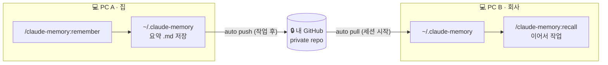

<div align="center">

# 🧠 claude-memory

### Cross-PC Persistent Memory for Claude Code

*세션과 PC를 넘어 맥락이 살아남는 Claude Code 메모리 플러그인*

작업 요약을 마크다운으로 저장하고, **각 사용자 본인의 GitHub**에 동기화해
어느 컴퓨터에서든 "어제 어디까지 했지"를 한 번에 복원합니다.

<br/>


</div>

---

## ⚡ Quick Start

```text
/plugin marketplace add shimeeuisuk/claude-memory-plugin
/plugin install claude-memory

/claude-memory:setup        # 최초 1회 — 내 GitHub에 메모리 저장소 연결
/claude-memory:remember     # 작업 저장
/claude-memory:recall       # 다른 날 / 다른 PC에서 이어서
```

> 필요 조건: [Claude Code](https://claude.com/claude-code) + [GitHub CLI (`gh`)](https://cli.github.com/) 로그인.
> 자세한 배경·작동 방식은 아래로 ↓

---

## 🔍 문제 (Why)

Claude Code(및 모든 LLM)는 **세션이 끝나면 맥락을 잃습니다.** 다음 날, 다른 PC에서 켜면
"내가 뭘 하고 있었는지"부터 매번 설명해야 합니다.

내장 `claude --resume` 이 있지만 —

- 🖥️ **단일 PC에 묶임** — 집에서 한 작업이 회사 PC엔 없음
- 📦 **대화 날것 복원** — 토큰이 무겁고, 핵심만 골라 보기 어려움

## 💡 해결 (What)

`claude-memory` 는 **요약된 기억을 마크다운으로 저장하고, git으로 PC 간 동기화**합니다.
대화 전체가 아니라 *큐레이션된 요약*을, 단일 PC가 아니라 *내 모든 PC*에서.

| 명령어 | 하는 일 |
|---|---|
| `/claude-memory:setup` | 내 GitHub에 private 메모리 저장소를 생성·연결 (최초 1회) |
| `/claude-memory:remember` | 지금까지의 작업을 요약해 저장 + 자동 백업 |
| `/claude-memory:recall` | 과거 기억을 불러와 "어디까지 했는지" 브리핑 |

---

## 📦 설치

**필요 조건**
- [Claude Code](https://claude.com/claude-code)
- [GitHub CLI (`gh`)](https://cli.github.com/) — 로그인 상태(`gh auth login`). PC 간 동기화에 사용.

**1. 플러그인 설치** (Claude Code 안에서)

```text
/plugin marketplace add shimeeuisuk/claude-memory-plugin
/plugin install claude-memory
```

> 로컬에서 먼저 시험하려면: `/plugin marketplace add ~/claude-memory-plugin`

**2. 최초 1회 — 내 GitHub에 메모리 저장소 연결**

```text
/claude-memory:setup
```

이걸로 설치 끝. 이후부터는 자동으로 동기화됩니다.

## 🚀 사용법

```text
/claude-memory:remember    # 작업하다가 — 지금까지 한 일을 저장
/claude-memory:recall      # 다음 날 / 다른 PC에서 — 이어서
```

- **세션 시작** 시 다른 PC의 기억을 자동으로 받아오고(pull),
- **작업 저장** 후 자동으로 백업(push)됩니다.

---

## 🏗️ 작동 방식 (How)



읽기는 항상 **로컬에서** 일어나고(local-first), GitHub는 세션 경계에서만 동기화합니다.
기억은 프로젝트별 폴더로 자동 분리됩니다:

```
~/.claude-memory/
├── my-app/
│   ├── 20260604-1530-결제버그-수정.md
│   └── 20260605-0900-배포-준비.md
└── side-project/
    └── 20260606-1400-초기-설계.md
```

---

## 🧱 설계 원칙

| 원칙 | 이유 |
|---|---|
| 🗂️ **마크다운 저장** | 사람·기계 모두 읽음 · 의존성 0 · git 친화 · 검색 용이 |
| 🧩 **코드 ≠ 데이터 분리** | 이 repo는 공개 코드, 기억은 각자 *private* 저장소로 |
| 👤 **각자 자기 GitHub** | 멀티유저 — 누가 설치하든 자기 데이터는 자기 계정에만 |
| 🪶 **local-first** | 오프라인에서도 저장됨, 온라인이면 자동 동기화 |

---

## 🛡️ 견고함 (Failure-Mode 대응)

단순 `push`/`pull`을 넘어, 실제 실패 시나리오를 분석하고 막았습니다.

| 상황 | 대응 |
|---|---|
| **조용한 백업 실패** | push가 끝내 실패하면 침묵하지 않고 ⚠️ 경고를 띄움 |
| **두 PC 동시 작업** | push 거부 시 자동 `pull --rebase` 후 재시도 → 양쪽 기억 모두 보존 |
| **동기화 충돌** | rebase 실패를 조용히 넘기지 않고 수동 확인 안내 |
| **연결 전 사용** | git 미연결 시 로컬 저장만 하고 graceful하게 안내 (멱등) |

> 동시 작업 보존은 두 PC를 시뮬레이션한 테스트로 검증했습니다.

---

## 🔐 데이터는 어디에?

- **플러그인 코드** (이 repo) — 공개. 누구나 설치 가능.
- **당신의 기억** — `~/.claude-memory/` 에 저장되고, **당신 소유의 private GitHub repo**로만 동기화됨.

코드와 데이터가 완전히 분리되어 있어, 이 플러그인을 설치해도 **당신의 기억이 외부로 새지 않습니다.**

---

<div align="center">

*Built as a study of agent memory design for Claude Code.*

</div>
