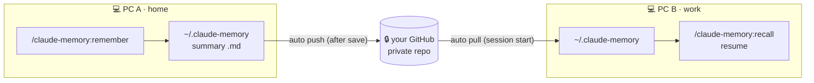

<div align="center">

# 🧠 claude-memory

**Cross-PC persistent memory for Claude Code.**

Save curated work summaries as Markdown and sync them to *your own* GitHub —
so context survives across sessions and machines.


</div>

---

## Features

- 🧠 **Persistent memory** across Claude Code sessions — no more re-explaining context.
- 🔄 **Cross-PC sync** — pick up on your work PC exactly where your home PC left off.
- 👤 **Your data, your account** — each user's memory syncs to *their own private* GitHub repo.
- 🗂️ **Plain Markdown** — human-readable, zero dependencies, git-friendly, greppable.
- 🪶 **Local-first** — works offline; syncs automatically when online.
- 🛡️ **Resilient** — handles silent backup failures and concurrent multi-PC edits.

## Installation

**Requirements:** [Claude Code](https://claude.com/claude-code) · [GitHub CLI (`gh`)](https://cli.github.com/) (logged in via `gh auth login`)

```
/plugin marketplace add shimeeuisuk/claude-memory-plugin
/plugin install claude-memory
```

> To try it from a local clone instead: `/plugin marketplace add ~/claude-memory-plugin`

## Updating

Installed plugins are local copies — they do **not** auto-update when this repo changes.
To pull the latest version:

```
/plugin marketplace update claude-memory-marketplace
/plugin update claude-memory
```

> Or open `/plugin` → **Marketplaces / Installed** tab and update from there.

## Usage

```
/claude-memory:setup       # one-time — connect a private memory repo on your GitHub
/claude-memory:remember    # save the current work as a summary
/claude-memory:recall      # resume — briefs you on where you left off
```

| Command | What it does |
| --- | --- |
| `/claude-memory:setup` | Creates & connects a **private** memory repo on your GitHub (run once) |
| `/claude-memory:remember` | Summarizes the current session and saves it + auto-backup |
| `/claude-memory:recall` | Loads past memories and briefs you on the last state |

Memory is **pulled automatically at session start** and **pushed automatically after each save**.

## How It Works



Reads are always **local-first**; GitHub is only touched at session boundaries.
Memories are organized per project automatically:

```
~/.claude-memory/
├── my-app/
│   ├── 20260604-1530-fix-payment-bug.md
│   └── 20260605-0900-prep-release.md
└── side-project/
    └── 20260606-1400-initial-design.md
```

Each memory file carries a small frontmatter header (`date`, `project`, `summary`,
`keywords`, `next`) so that `recall` can grep it and reconstruct *what to do next*.

## Reliability

Beyond a naive `push`/`pull`, real failure modes are handled:

| Scenario | Handling |
| --- | --- |
| Backup ultimately fails | Surfaces a ⚠️ warning instead of failing silently |
| Two PCs edit at once | On a rejected push, auto `pull --rebase` then retry — both memories preserved |
| Sync conflict | Doesn't silently drop remote changes; prompts for manual review |
| Used before setup | Saves locally and degrades gracefully (idempotent) |

> Concurrent-edit preservation is verified by a two-PC simulation test.

## Design

| Principle | Why |
| --- | --- |
| Markdown storage | Readable by humans & machines, zero deps, git-native |
| Code ≠ data separation | This repo is public code; memories live in each user's **private** repo |
| Per-user GitHub | Multi-user by design — your data never lands in someone else's account |

## License

MIT
